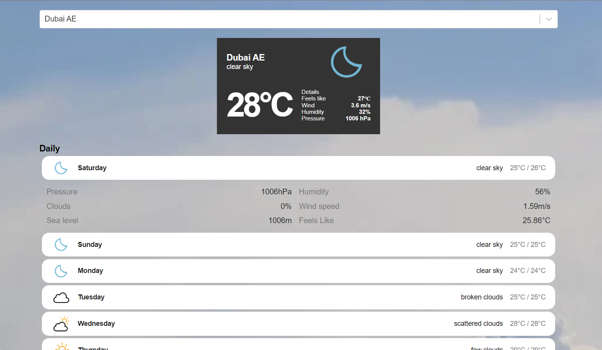

### Awesome React Weather Application

## Table Of Contents

* [About the Project](#about-the-project)
* [Built With](#built-with)
* [Getting Started](#getting-started)
  * [Installation](#installation)

## About The Project




## Built With

React<br/>
React-Accessible-Accordion<br/>
React-Select-Async-Paginate<br/>

## Getting Started


### Installation

1. Clone the repo

```sh
git clone https://github.com/thrillu4/weather-app.git
```

3. Install NPM packages

```sh
npm install
```

4. Start project

```sh
npm start
```
